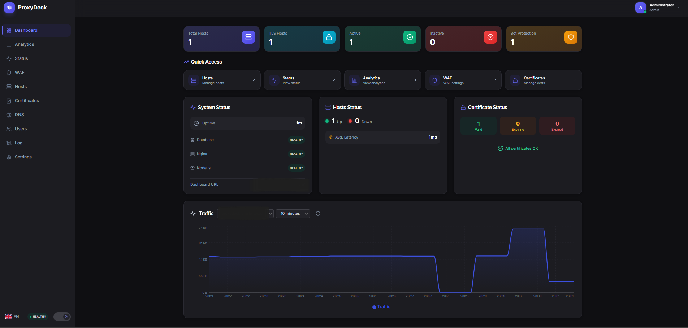

<p align="center">
  
</p>

<h1 align="center">ProxyDeck</h1>

<p align="center">
  <strong>Enterprise-grade self-hosted reverse proxy management platform</strong>
</p>

<p align="center">
  Reverse Proxy | SSL Automation | WAF | Bot Protection | IP Reputation | Geo-Blocking | PIN Access | DNS Management | Anomaly Detection | Alerting | Scheduled Maintenance | Analytics | SSO | MFA | Passkeys | Granular Permissions
</p>

---

> [!WARNING]
> **Docker Hub Account Changed (v0.1.43+)**: The image has moved from `pamsler/proxydeck` to `amslertec/proxydeck`.
> Update your `docker-compose.yml`:
> ```yaml
> image: amslertec/proxydeck:${IMAGE_TAG:-latest}
> ```
> Then pull the new image:
> ```bash
> docker compose pull && docker compose up -d
> ```

---

## Screenshot

### Dashboard



*Real-time overview of traffic, requests, and system health*

---

## Features

### Reverse Proxy Management
- **Easy Host Configuration** - Add and manage proxy hosts through an intuitive web interface
- **Multiple Backends** - Support for HTTP and HTTPS upstream servers
- **Upstream Load Balancing** - Distribute traffic across multiple backend servers with:
  - **Load Balancing Methods**: Round Robin (default), Least Connections, IP Hash
  - **Server Weights**: Configure traffic distribution per server (1-100)
  - **Backup Servers**: Define fallback servers for high availability
  - **Health Checks**: Real-time TCP health status for each upstream server
  - **Advanced Options**: Max fails, fail timeout, server down toggle
  - **Drag & Drop**: Reorder servers via drag and drop
- **WebSocket Support** - Full WebSocket proxying capabilities
- **HTTP/2 & HTTP/3 (QUIC)** - Modern protocol support for improved performance
- **Custom Nginx Config** - Advanced configuration options per host
- **HSTS Headers** - Configurable Strict-Transport-Security with preload support
- **SSRF Protection** - Blocks localhost and cloud metadata endpoint access

### SSL/TLS Certificate Management
- **Let's Encrypt Integration** - Automatic SSL certificate issuance and renewal
- **HTTP-01 & DNS-01 Challenges** - Support for both validation methods
- **Wildcard Certificates** - Issue wildcard certs via DNS-01 challenge
- **Custom Certificates** - Import your own SSL certificates (PEM format)
- **Certificate Monitoring** - Automatic expiry alerts (14/30/365 days)
- **Certificate Transparency** - CT log monitoring for your domains
- **Rate Limit Tracking** - Prevents hitting Let's Encrypt rate limits
- **Multi-Account Support** - Manage multiple ACME accounts

### DNS Management
- **Multi-Provider Support** - Cloudflare and Hetzner DNS integration
- **Zone Management** - View and manage all your DNS zones
- **Record Management** - Create, update, and delete DNS records (A, AAAA, CNAME, MX, TXT, etc.)
- **Available Domains** - See which domains from your DNS zones can be used for new proxy hosts
- **Credential Verification** - Validate API tokens before saving
- **DNS-01 Automation** - Automatic DNS record creation for Let's Encrypt wildcard certificates

### Web Application Firewall (WAF)
- **SQL Injection Protection** - Detects and blocks SQL injection attempts
- **XSS Prevention** - Cross-site scripting attack mitigation
- **Path Traversal Detection** - Blocks directory traversal attacks
- **Body Content Inspection** - Deep request analysis
- **Custom Rules** - Define your own WAF rules per host
- **Real-time Event Logging** - View and analyze security events
- **IP Banning** - Automatic and manual IP blocking
- **Ban Whitelist** - Exclude trusted IPs from blocking
- **Host Groups** - Organize hosts into named groups with color coding for bulk operations

### IP Reputation (AbuseIPDB & AlienVault OTX)
- **External Reputation Checks** - Automatic background IP lookups against AbuseIPDB and AlienVault OTX
- **AbuseIPDB Integration** - Optional API key (free tier: 1,000 queries/day), reports abuse confidence, ISP, Tor detection
- **AlienVault OTX** - Works without API key, community threat intelligence with pulse counts and tags
- **Auto-Ban** - Configurable threshold (default 75/100) with automatic ban for high-risk IPs
- **Redis Caching** - Results cached (default 24h TTL) to minimize API calls
- **IP Test Tool** - Live reputation lookup for any IP directly from the WAF dashboard
- **Whitelist Support** - Exclude trusted IPs/CIDRs from reputation checks
- **Threat Score Integration** - Reputation score contributes up to +30 points to the threat scoring system
- **Non-Blocking** - Fire-and-forget checks that never delay or block requests (including streaming)

### Bot Protection
- **JavaScript Challenge** - Browser verification for suspicious requests
- **CAPTCHA Slider Challenge** - Human verification system
- **Threat Scoring** - Intelligent threat analysis and scoring
- **Automatic Banning** - Block malicious IPs automatically
- **Progressive Bans** - Escalating ban durations (1h, 6h, 24h, permanent)
- **Bot Whitelist** - Allow known good bots
- **Configurable Thresholds** - Fine-tune protection levels per host

### Access Control
- **Password Authentication (Gate)** - Protect hosts with username and password login via WAF rules
- **PIN Authentication** - Lightweight access control requiring only a PIN (no username needed)
  - Multiple PINs per rule, securely stored as bcrypt hashes
  - Configurable per host, multiple hosts, or globally
  - Dedicated PIN entry page with dark mode and multi-language support
  - Progressive IP banning after failed attempts
  - Bypass IPs for trusted networks
- **Session Cookies** - Secure JWT-based session tokens bound to host, user-agent, and IP subnet

### Scheduled Maintenance Windows
- **Maintenance Scheduling** - Plan maintenance windows with start and end times
- **Custom Maintenance Pages** - Branded maintenance pages with countdown timer
- **Bilingual Support** - Maintenance messages in German and English with language toggle
- **Predefined Templates** - Quick setup with System Update, Planned Maintenance, and Emergency templates
- **Custom Templates** - Create custom maintenance messages with optional translations
- **Dark/Light Mode** - Maintenance page respects user theme preference
- **Instant Activation** - Maintenance mode activates immediately when start time is now or in the past
- **Automatic nginx Configuration** - Nginx automatically rewrites config during maintenance
- **Cancel Early** - End maintenance windows before scheduled end time
- **Visual Status Indicators** - Yellow "Maintenance" status in host tables and cards

### Geo-Blocking & GeoIP
- **Country-based Blocking** - Block or allow traffic by country
- **GeoIP Database** - Automatic IP geolocation
- **Flexible Rules** - Allow-list or block-list mode
- **Geographic Analytics** - Visualize traffic origins on a world map
- **Internal IP Whitelist** - Automatic bypass for private IPs

### Rate Limiting
- **Request Rate Limiting** - Protect against DDoS and abuse
- **Per-Host Configuration** - Different limits for different services
- **Burst Handling** - Allow temporary traffic spikes
- **IP Whitelisting** - Bypass limits for trusted IPs
- **Redis-backed** - Distributed rate limiting across instances
- **Progressive Blocking** - Escalating responses for repeat offenders

### Analytics & Monitoring
- **Real-time Dashboard** - Live traffic and request monitoring
- **Traffic Analytics** - Detailed request statistics and trends (10min to 365 days)
- **Geographic Distribution** - Visualize traffic origins on a world map
- **Protocol Distribution** - HTTP/HTTPS/HTTP2/HTTP3 breakdown
- **Top Endpoints** - Most accessed paths and resources
- **Bandwidth Metrics** - Bits per second monitoring
- **Historical Data** - Long-term analytics storage
- **Response Time Distribution** - P50/P75/P90/P95/P99 percentile breakdown with histogram visualization
- **Per-Host Latency** - Sortable response time breakdown per upstream host
- **Traffic Anomaly Detection** - Automatic baseline computation (14-day rolling) with z-score deviation alerts
- **Anomaly Types** - Traffic spikes/drops, error spikes, bandwidth anomalies with warning/critical severity

### Uptime Monitoring
- **TCP Health Checks** - Verify backend connectivity
- **HTTP/HTTPS Checks** - Full request-based health verification
- **Latency Measurement** - Response time tracking
- **Availability Percentage** - Uptime statistics
- **Historical Series** - Uptime trends over time
- **Status Change Tracking** - Detect and alert on state changes

### User Management & Permissions
- **Multi-User Support** - Multiple admin accounts with role-based access
- **Granular Permissions** - Fine-grained access control per user:
  - 8 permission categories (Hosts, Certs, WAF, DNS, Users, Settings, Audit, Analytics)
  - Multiple actions per category (view, create, edit, delete, manage)
  - Permission presets (Read-Only, Power-User, Full Access)
  - Live updates without re-login required
- **Role-Based Access** - Admin (full access) and User (configurable) roles
- **Permission-Aware UI** - Buttons disabled with tooltips for unauthorized actions
- **Password Policy** - Strong password requirements (8-128 chars, mixed case, numbers)
- **Bcrypt Hashing** - Secure password storage (12 rounds)

### Multi-Factor Authentication (MFA)
- **TOTP Support** - Google Authenticator, Authy compatible
- **QR Code Setup** - Easy enrollment via QR code
- **Backup Codes** - 10 single-use recovery codes
- **Encrypted Storage** - ChaCha20-Poly1305 encryption for secrets
- **Admin MFA Reset** - Administrators can reset user MFA

### Passkey Authentication (WebAuthn/FIDO2)
- **Passwordless Login** - Sign in with biometrics or security keys
- **Multiple Passkeys** - Register multiple devices per user
- **Passkey Management** - Rename and delete passkeys
- **Cross-Platform** - Works on all modern browsers and devices

### Single Sign-On (SSO)
- **Microsoft Entra ID** - Azure AD integration
- **PKCE OAuth2** - Secure authentication flow
- **User Profile Sync** - Automatic profile updates from IdP
- **Group Membership** - Access control based on AD groups
- **Auto User Creation** - Automatic account provisioning
- **User Photo Sync** - Fetch profile pictures from Azure AD
- **SSO User Permissions** - Granular permissions for SSO accounts

### Backup & Restore
- **Full Configuration Backup** - Export all settings and data
- **Encrypted Backups** - Secure backup storage
- **Backup Scheduling** - Automated backup creation
- **One-Click Restore** - Easy system recovery
- **Backup Download** - Download backups as files

### Alerting & Notifications
- **Slack Integration** - Rich messages via Incoming Webhooks with color-coded attachments
- **Discord Integration** - Embed messages with colored sidebars and inline fields
- **Telegram Integration** - HTML-formatted messages via Bot API with emoji severity indicators
- **Email Notifications** - SMTP-based alert delivery
- **Webhook Notifications** - Event-driven HTTP callbacks with Mattermost/Slack compatibility
- **Enhanced Webhook Filters** - Filter by status code, response time, host, IP pattern, and severity
- **Per-Rule Channels** - Select notification channels individually per alert rule
- **Test Buttons** - Verify each notification channel with a test message

### API & Integration
- **RESTful API** - Full API access for automation
- **API Key Authentication** - Secure API access tokens with tier-based rate limiting
- **Rate Limit Tiers** - Free, Basic, Pro, Enterprise, and Unlimited tiers with per-key quotas
- **API Usage Analytics** - Per-key usage tracking with sparkline charts and quota progress
- **Webhooks** - Event notifications to external services with granular event filters
- **SMTP Integration** - Email notifications for alerts
- **Notification Preferences** - Per-user notification settings
- **Quiet Windows** - Suppress notifications during specified hours

### Audit Logging
- **Comprehensive Logging** - Track all system changes
- **User Attribution** - Who did what and when
- **IP Tracking** - Client IP logging
- **Full-Text Search** - Search through audit logs
- **Filtering & Pagination** - Easy log navigation
- **SSO Audit Trail** - Separate SSO-specific logging

### System Features
- **Dark Mode UI** - Modern, responsive web interface
- **Multi-language** - English and German interface
- **Real-time Updates** - WebSocket-based live updates
- **Mobile Responsive** - Works on all screen sizes
- **CSRF Protection** - Secure form submissions
- **Session Management** - Automatic idle timeout (30 min)

---

## Architecture

ProxyDeck runs as a Docker container with the following components:

- **Nginx** - High-performance reverse proxy server with Lua scripting
- **Node.js** - Backend API and management server
- **PostgreSQL** - Configuration and analytics database
- **Redis** - Caching, rate limiting, and session management
- **Supervisord** - Process management

---

## Requirements

- Docker and Docker Compose
- 4GB RAM minimum (8GB recommended)
- 2 CPU cores minimum (4 recommended)
- Ports 80, 443, and 8080 available

---

## Prerequisites

Before starting, ensure:

- **Ports 80 and 443** are forwarded to your server (required for Let's Encrypt)
- **A domain name** pointing to your server's IP address
- Docker and Docker Compose installed

> **Important:** ProxyDeck requires a valid domain with SSL certificate. Access via IP address only will cause session issues (logout on page reload).

---

## Quick Start

### 1. Download files

```bash
mkdir proxydeck && cd proxydeck
curl -fsSL https://raw.githubusercontent.com/amslertec/proxydeck/main/docker-compose.prod.yml -o docker-compose.prod.yml
curl -fsSL https://raw.githubusercontent.com/amslertec/proxydeck/main/.env.example -o .env
```

### 2. Configure environment

Edit `.env` and configure:

```bash
# Admin credentials
ADMIN_USER=admin
ADMIN_PASS=your-secure-password-here

# Security keys (generate with: openssl rand -hex 64)
JWT_SECRET=your-64-char-hex-secret
MFA_ENCRYPTION_KEY=your-64-char-hex-key

# REQUIRED: Your domain for the dashboard (SSL certificate will be auto-generated)
FRONTEND_URL=https://proxydeck.yourdomain.com

# REQUIRED: Email for Let's Encrypt certificates
ACME_EMAIL=your-email@example.com
```

> **Note:** `FRONTEND_URL` is required for the first start. ProxyDeck will automatically create a proxy host and request an SSL certificate for this domain.

### 3. Create backup directory

```bash
mkdir -p backup
```

### 4. Start ProxyDeck

```bash
docker compose -f docker-compose.prod.yml up -d
```

### 5. Access the dashboard

Open `http://your-server-ip:8080` in your browser and log in with your admin credentials.

---

## Configuration

### Environment Variables

| Variable | Required | Default | Description |
|----------|----------|---------|-------------|
| `IMAGE_TAG` | No | `latest` | Docker image version (latest, v0.1.x) |
| `ADMIN_USER` | Yes | - | Admin username |
| `ADMIN_PASS` | Yes | - | Admin password |
| `JWT_SECRET` | Yes | - | JWT signing secret (64+ chars) |
| `MFA_ENCRYPTION_KEY` | Yes | - | MFA encryption key (64+ chars) |
| `FRONTEND_URL` | Yes | - | Dashboard domain (auto-creates proxy + SSL) |
| `ACME_EMAIL` | Yes | - | Let's Encrypt registration email |
| `ADMIN_EMAIL` | No | - | Admin email for notifications |
| `ACME_ACCOUNT` | No | - | Specific LE account to use |
| `TZ` | No | `Europe/Zurich` | Timezone |
| `ENABLE_H3` | No | `1` | Enable HTTP/3 (QUIC) |
| `MICROCACHE_SECS` | No | `5` | Micro-cache duration |
| `ISOLATION_HEADERS` | No | `0` | Enable COOP/COEP/CORP headers |

### Ports

| Port | Protocol | Description |
|------|----------|-------------|
| 80 | HTTP | HTTP traffic and ACME challenges |
| 443 | HTTPS | HTTPS traffic |
| 8080 | HTTP | Management dashboard |

### Volumes

| Volume | Description |
|--------|-------------|
| `confd` | Nginx configuration files |
| `data` | Application data |
| `certs` | SSL certificates |
| `acme` | ACME challenge files |
| `le_etc` | Let's Encrypt configuration |
| `le_var` | Let's Encrypt work directory |
| `le_log` | Let's Encrypt logs |
| `pgdata` | PostgreSQL database |
| `redis_data` | Redis persistence |

---

## Updating

To update to a new version:

```bash
# Pull the latest image
docker compose -f docker-compose.prod.yml pull

# Restart with new image
docker compose -f docker-compose.prod.yml up -d
```

Or specify a specific version in `.env`:

```bash
IMAGE_TAG=v0.1.48
```

### Available Tags

| Tag | Description |
|-----|-------------|
| `latest` | Latest stable release (recommended) |
| `v0.1.x` | Current releases |

---

## Security Recommendations

1. **Change default credentials** - Never use default passwords in production
2. **Enable MFA** - Set up two-factor authentication for all admin accounts
3. **Use Passkeys** - Consider passwordless authentication for enhanced security
4. **Use HTTPS** - Set up SSL for the management dashboard
5. **Restrict access** - Use firewall rules to limit dashboard access
6. **Configure Permissions** - Use granular permissions to limit user access
7. **Enable Geo-Blocking** - Block traffic from countries you don't serve
8. **Configure WAF** - Enable WAF rules for all public-facing hosts
9. **Regular backups** - Enable automatic backups in settings
10. **Keep updated** - Regularly update to the latest version
11. **Review audit logs** - Monitor for suspicious activity

---

## API Documentation

ProxyDeck provides a RESTful API for automation. Generate API keys in Settings > API Keys.

Example:
```bash
curl -H "X-API-Key: your-api-key" http://localhost:8080/api/proxies
```

---

## Monitoring & Observability

ProxyDeck provides built-in endpoints for monitoring with Prometheus and Grafana.

### Health Checks

| Endpoint | Description |
|----------|-------------|
| `GET /health` | Full health check (database, Redis) |
| `GET /health/live` | Liveness probe (always 200 if running) |
| `GET /health/ready` | Readiness probe (checks database) |

Example:
```bash
curl http://localhost:8080/health
```

Response:
```json
{
  "status": "healthy",
  "timestamp": "2024-01-03T12:00:00.000Z",
  "uptime": 3600,
  "checks": {
    "database": { "ok": true, "latency": 2 },
    "redis": { "ok": true }
  }
}
```

### Prometheus Metrics

ProxyDeck exposes metrics in Prometheus format at `/metrics`.

```bash
curl http://localhost:8080/metrics
```

#### Available Metrics

| Metric | Type | Description |
|--------|------|-------------|
| `proxydeck_http_requests_total` | Counter | Total HTTP requests by method, status, route |
| `proxydeck_http_request_duration_seconds` | Histogram | Request duration distribution |
| `proxydeck_http_requests_in_flight` | Gauge | Currently processing requests |
| `proxydeck_proxies_total` | Gauge | Total configured proxy hosts |
| `proxydeck_proxies_enabled` | Gauge | Enabled proxy hosts |
| `proxydeck_proxies_healthy` | Gauge | Healthy proxy hosts (uptime check) |
| `proxydeck_waf_events_total` | Counter | WAF events by action and reason |
| `proxydeck_waf_bans_total` | Counter | WAF bans by source and type |
| `proxydeck_waf_active_bans` | Gauge | Currently active WAF bans |
| `proxydeck_db_pool_total` | Gauge | Database connection pool size |
| `proxydeck_db_pool_idle` | Gauge | Idle database connections |
| `proxydeck_db_pool_waiting` | Gauge | Waiting database queries |
| `proxydeck_redis_connected` | Gauge | Redis connection status (1/0) |
| `proxydeck_uptime_seconds` | Gauge | Process uptime in seconds |

### Prometheus Configuration

Add ProxyDeck to your `prometheus.yml`:

```yaml
scrape_configs:
  - job_name: 'proxydeck'
    static_configs:
      - targets: ['proxydeck:8080']
    metrics_path: '/metrics'
    scrape_interval: 15s
```

If running Prometheus outside Docker, use your server's IP:

```yaml
scrape_configs:
  - job_name: 'proxydeck'
    static_configs:
      - targets: ['your-server-ip:8080']
```

### Grafana Dashboard

Import the metrics into Grafana and create dashboards for:

- **Request Rate**: `rate(proxydeck_http_requests_total[5m])`
- **Error Rate**: `rate(proxydeck_http_requests_total{status="5xx"}[5m])`
- **Request Duration**: `histogram_quantile(0.95, rate(proxydeck_http_request_duration_seconds_bucket[5m]))`
- **Active Bans**: `proxydeck_waf_active_bans`
- **Proxy Health**: `proxydeck_proxies_healthy / proxydeck_proxies_enabled * 100`

### Docker Compose with Prometheus & Grafana

Example `docker-compose.monitoring.yml`:

```yaml
services:
  prometheus:
    image: prom/prometheus:latest
    volumes:
      - ./prometheus.yml:/etc/prometheus/prometheus.yml
      - prometheus_data:/prometheus
    command:
      - '--config.file=/etc/prometheus/prometheus.yml'
      - '--storage.tsdb.path=/prometheus'
    ports:
      - "9090:9090"
    extra_hosts:
      - "host.docker.internal:host-gateway"

  grafana:
    image: grafana/grafana:latest
    volumes:
      - grafana_data:/var/lib/grafana
    ports:
      - "3000:3000"
    environment:
      - GF_SECURITY_ADMIN_PASSWORD=admin

volumes:
  prometheus_data:
  grafana_data:
```

---

## License

This project is licensed under the MIT License - see the [LICENSE](LICENSE) file for details.

---

**Note**: This repository contains only the deployment configuration. The application is distributed as a Docker image via Docker Hub.

