<p align="center">
  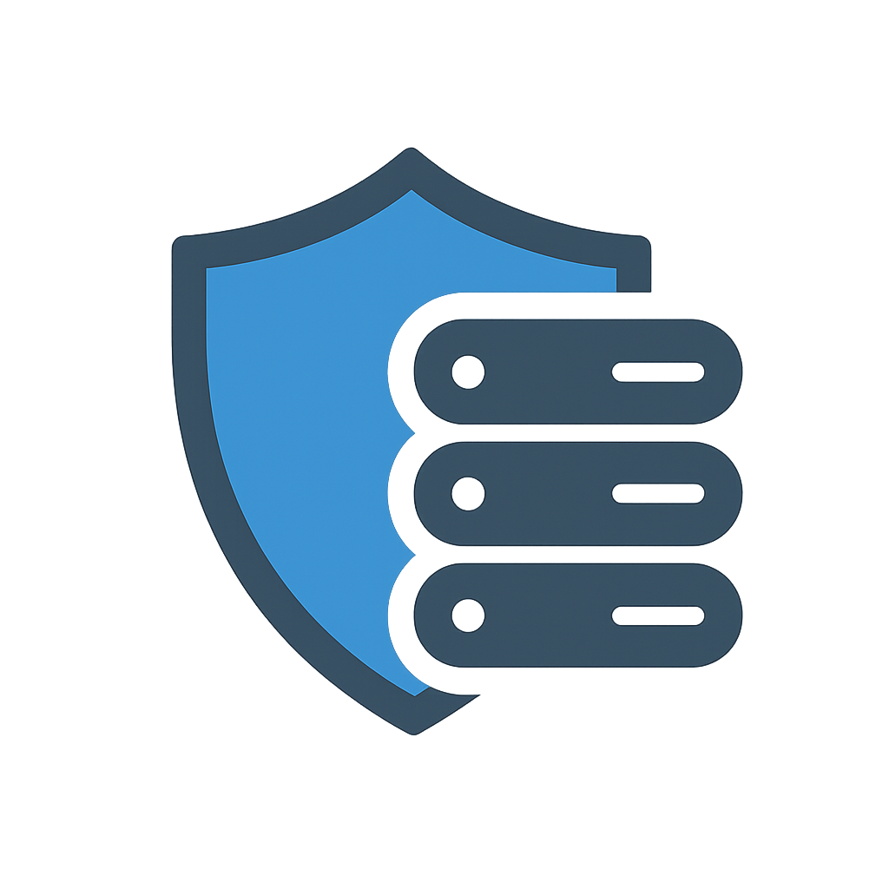
</p>

<h1 align="center">ProxyDeck</h1>

<p align="center">
  <strong>Enterprise-grade self-hosted reverse proxy management platform</strong>
</p>

<p align="center">
  Reverse Proxy | SSL Automation | WAF | Bot Protection | Geo-Blocking | DNS Management | Analytics | SSO | MFA | Passkeys
</p>

---

## Screenshots

### Dashboard


*Real-time overview of traffic, requests, and system health*

### Proxy Hosts
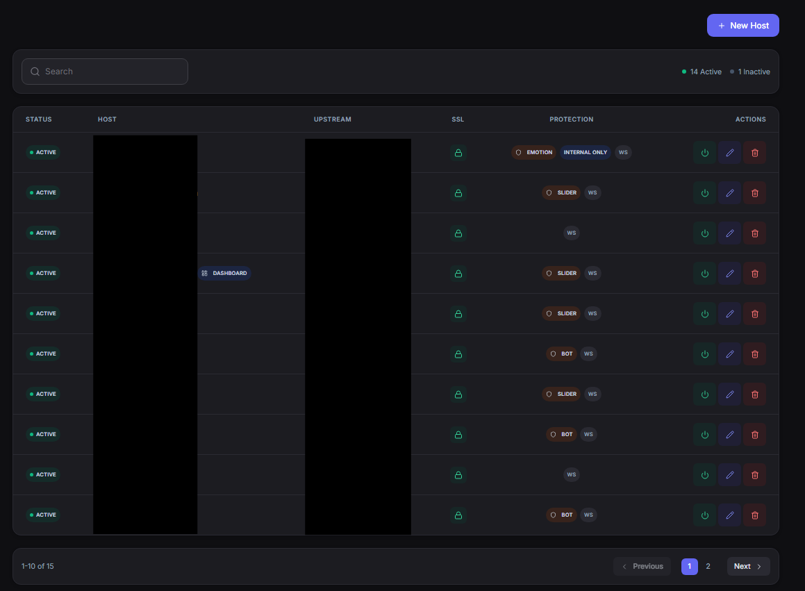

*Manage reverse proxy configurations with SSL settings*

### SSL Certificates
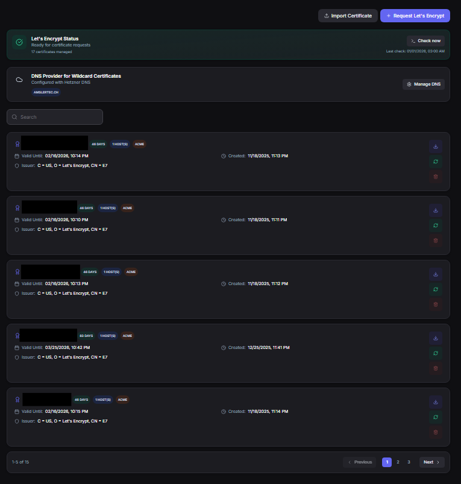

*Let's Encrypt integration with automatic renewal*

### WAF & Security
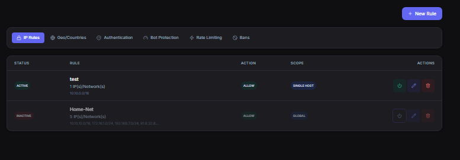

*Web Application Firewall with real-time event logging*

### Bot Protection
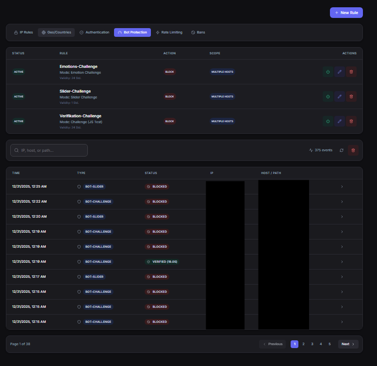

*JavaScript challenges and threat scoring*

### Analytics
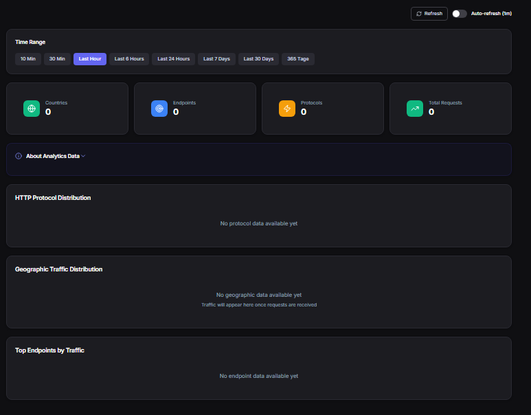

*Traffic analytics with geographic distribution*

### Status Monitoring
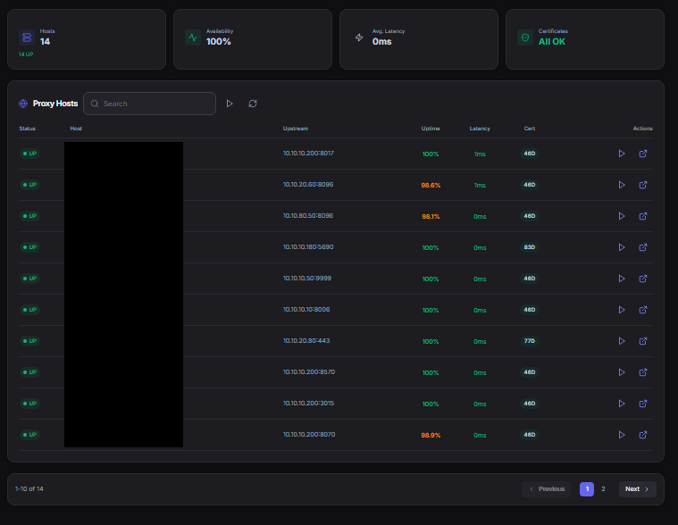

*Uptime monitoring and health checks*

### User Management
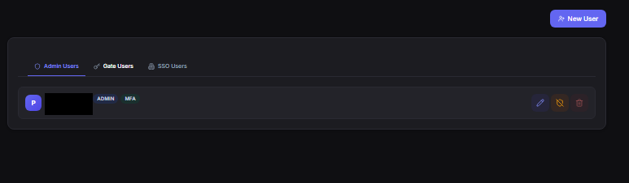

*Multi-user support with MFA and Passkeys*

### DNS Management
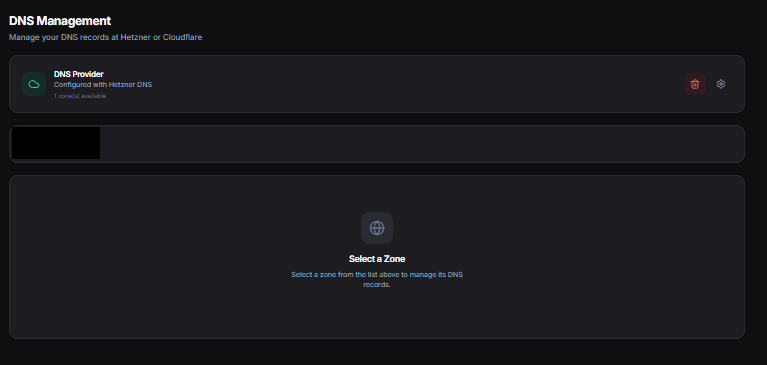

*Manage DNS zones and records with Cloudflare/Hetzner integration*

### Profile
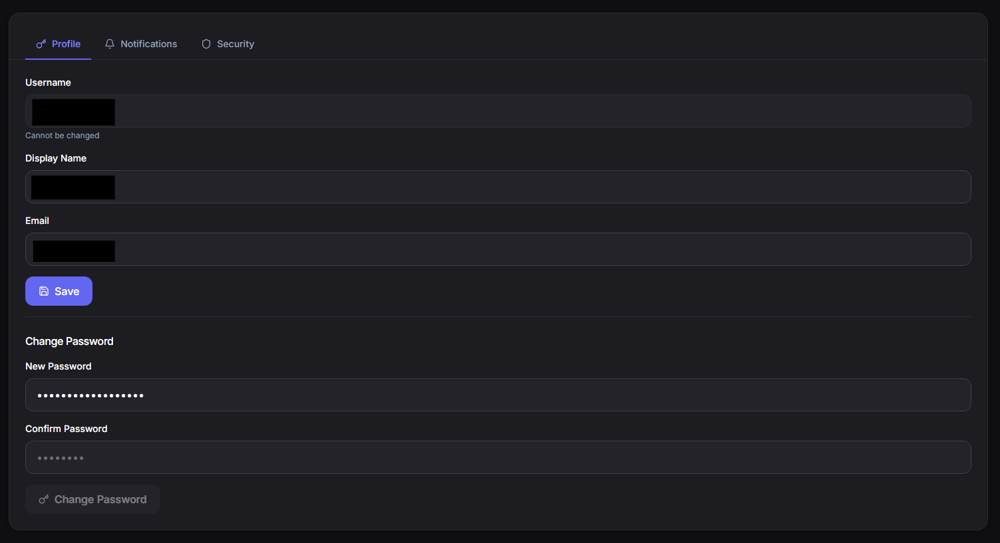

*User profile with MFA and Passkey management*

### Audit Log
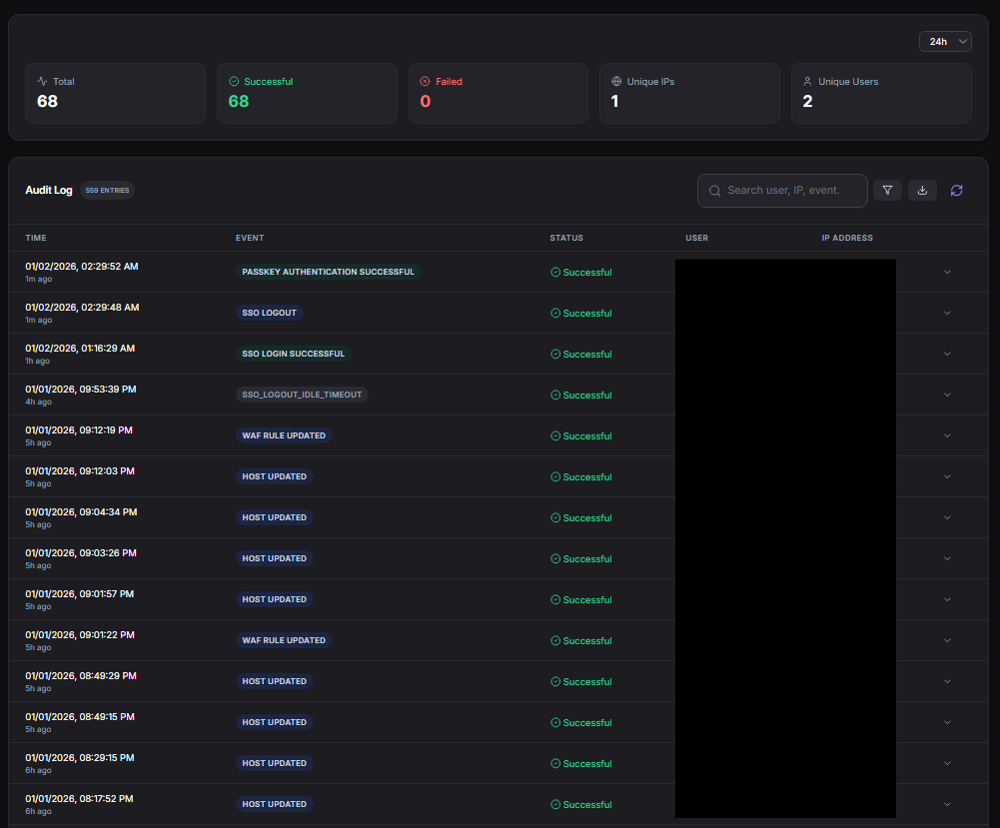

*Complete audit trail of all system changes*

### Settings
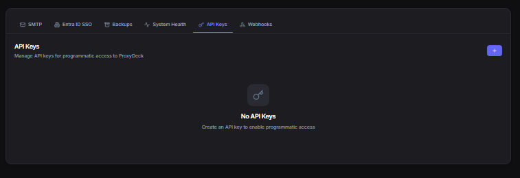

*Backup, API keys, webhooks, and SMTP configuration*

---

## Features

### Reverse Proxy Management
- **Easy Host Configuration** - Add and manage proxy hosts through an intuitive web interface
- **Multiple Backends** - Support for HTTP and HTTPS upstream servers
- **Load Balancing** - Distribute traffic across multiple backend servers
- **WebSocket Support** - Full WebSocket proxying capabilities
- **HTTP/2 & HTTP/3 (QUIC)** - Modern protocol support for improved performance
- **Custom Nginx Config** - Advanced configuration options per host
- **HSTS Headers** - Configurable Strict-Transport-Security with preload support
- **SSRF Protection** - Blocks localhost and cloud metadata endpoint access

### SSL/TLS Certificate Management
- **Let's Encrypt Integration** - Automatic SSL certificate issuance and renewal
- **HTTP-01 & DNS-01 Challenges** - Support for both validation methods
- **Wildcard Certificates** - Issue wildcard certs via DNS-01 challenge
- **Custom Certificates** - Import your own SSL certificates (PEM format)
- **Certificate Monitoring** - Automatic expiry alerts (14/30/365 days)
- **Certificate Transparency** - CT log monitoring for your domains
- **Rate Limit Tracking** - Prevents hitting Let's Encrypt rate limits
- **Multi-Account Support** - Manage multiple ACME accounts

### DNS Management
- **Multi-Provider Support** - Cloudflare and Hetzner DNS integration
- **Zone Management** - View and manage all your DNS zones
- **Record Management** - Create, update, and delete DNS records (A, AAAA, CNAME, MX, TXT, etc.)
- **Available Domains** - See which domains from your DNS zones can be used for new proxy hosts
- **Credential Verification** - Validate API tokens before saving
- **DNS-01 Automation** - Automatic DNS record creation for Let's Encrypt wildcard certificates

### Web Application Firewall (WAF)
- **SQL Injection Protection** - Detects and blocks SQL injection attempts
- **XSS Prevention** - Cross-site scripting attack mitigation
- **Path Traversal Detection** - Blocks directory traversal attacks
- **Body Content Inspection** - Deep request analysis
- **Custom Rules** - Define your own WAF rules per host
- **Real-time Event Logging** - View and analyze security events
- **IP Banning** - Automatic and manual IP blocking
- **Ban Whitelist** - Exclude trusted IPs from blocking

### Bot Protection
- **JavaScript Challenge** - Browser verification for suspicious requests
- **CAPTCHA Slider Challenge** - Human verification system
- **Threat Scoring** - Intelligent threat analysis and scoring
- **Automatic Banning** - Block malicious IPs automatically
- **Progressive Bans** - Escalating ban durations (1h, 6h, 24h, permanent)
- **Bot Whitelist** - Allow known good bots
- **Configurable Thresholds** - Fine-tune protection levels per host

### Geo-Blocking & GeoIP
- **Country-based Blocking** - Block or allow traffic by country
- **GeoIP Database** - Automatic IP geolocation
- **Flexible Rules** - Allow-list or block-list mode
- **Geographic Analytics** - Visualize traffic origins on a world map
- **Internal IP Whitelist** - Automatic bypass for private IPs

### Rate Limiting
- **Request Rate Limiting** - Protect against DDoS and abuse
- **Per-Host Configuration** - Different limits for different services
- **Burst Handling** - Allow temporary traffic spikes
- **IP Whitelisting** - Bypass limits for trusted IPs
- **Redis-backed** - Distributed rate limiting across instances
- **Progressive Blocking** - Escalating responses for repeat offenders

### Analytics & Monitoring
- **Real-time Dashboard** - Live traffic and request monitoring
- **Traffic Analytics** - Detailed request statistics and trends (10min to 365 days)
- **Geographic Distribution** - Visualize traffic origins on a world map
- **Protocol Distribution** - HTTP/HTTPS/HTTP2/HTTP3 breakdown
- **Top Endpoints** - Most accessed paths and resources
- **Bandwidth Metrics** - Bits per second monitoring
- **Historical Data** - Long-term analytics storage

### Uptime Monitoring
- **TCP Health Checks** - Verify backend connectivity
- **HTTP/HTTPS Checks** - Full request-based health verification
- **Latency Measurement** - Response time tracking
- **Availability Percentage** - Uptime statistics
- **Historical Series** - Uptime trends over time
- **Status Change Tracking** - Detect and alert on state changes

### User Management
- **Multi-User Support** - Multiple admin accounts with role-based access
- **Role-Based Access** - Admin and User roles
- **Password Policy** - Strong password requirements (8-128 chars, mixed case, numbers)
- **Bcrypt Hashing** - Secure password storage (12 rounds)

### Multi-Factor Authentication (MFA)
- **TOTP Support** - Google Authenticator, Authy compatible
- **QR Code Setup** - Easy enrollment via QR code
- **Backup Codes** - 10 single-use recovery codes
- **Encrypted Storage** - ChaCha20-Poly1305 encryption for secrets
- **Admin MFA Reset** - Administrators can reset user MFA

### Passkey Authentication (WebAuthn/FIDO2)
- **Passwordless Login** - Sign in with biometrics or security keys
- **Multiple Passkeys** - Register multiple devices per user
- **Passkey Management** - Rename and delete passkeys
- **Cross-Platform** - Works on all modern browsers and devices

### Single Sign-On (SSO)
- **Microsoft Entra ID** - Azure AD integration
- **PKCE OAuth2** - Secure authentication flow
- **User Profile Sync** - Automatic profile updates from IdP
- **Group Membership** - Access control based on AD groups
- **Auto User Creation** - Automatic account provisioning
- **User Photo Sync** - Fetch profile pictures from Azure AD

### Backup & Restore
- **Full Configuration Backup** - Export all settings and data
- **Encrypted Backups** - Secure backup storage
- **Backup Scheduling** - Automated backup creation
- **One-Click Restore** - Easy system recovery
- **Backup Download** - Download backups as files

### API & Integration
- **RESTful API** - Full API access for automation
- **API Key Authentication** - Secure API access tokens
- **Webhooks** - Event notifications to external services
- **SMTP Integration** - Email notifications for alerts
- **Notification Preferences** - Per-user notification settings
- **Quiet Windows** - Suppress notifications during specified hours

### Audit Logging
- **Comprehensive Logging** - Track all system changes
- **User Attribution** - Who did what and when
- **IP Tracking** - Client IP logging
- **Full-Text Search** - Search through audit logs
- **Filtering & Pagination** - Easy log navigation
- **SSO Audit Trail** - Separate SSO-specific logging

### System Features
- **Dark Mode UI** - Modern, responsive web interface
- **Multi-language** - English and German interface
- **Real-time Updates** - WebSocket-based live updates
- **Mobile Responsive** - Works on all screen sizes
- **CSRF Protection** - Secure form submissions
- **Session Management** - Automatic idle timeout (30 min)

---

## Architecture

ProxyDeck runs as a Docker container with the following components:

- **Nginx** - High-performance reverse proxy server with Lua scripting
- **Node.js** - Backend API and management server
- **PostgreSQL** - Configuration and analytics database
- **Redis** - Caching, rate limiting, and session management
- **Supervisord** - Process management

---

## Requirements

- Docker and Docker Compose
- 2GB RAM minimum (4GB recommended)
- 2 CPU cores minimum
- Ports 80, 443, and 8070 available

---

## Quick Start

### 1. Clone this repository

```bash
git clone https://github.com/pamsler/proxydeck.git
cd proxydeck
```

### 2. Create environment file

```bash
cp .env.example .env
```

### 3. Configure required variables

Edit `.env` and set at minimum:

```bash
# Admin credentials
ADMIN_USER=admin
ADMIN_PASS=your-secure-password-here

# Security keys (generate with: openssl rand -hex 64)
JWT_SECRET=your-64-char-hex-secret
MFA_ENCRYPTION_KEY=your-64-char-hex-key

# Optional: Let's Encrypt email for SSL certificates
ACME_EMAIL=your-email@example.com
```

### 4. Create backup directory

```bash
mkdir -p backup
```

### 5. Start ProxyDeck

```bash
docker compose -f docker-compose.prod.yml up -d
```

### 6. Access the dashboard

Open `http://your-server-ip:8070` in your browser and log in with your admin credentials.

---

## Configuration

### Environment Variables

| Variable | Required | Default | Description |
|----------|----------|---------|-------------|
| `IMAGE_TAG` | No | `latest` | Docker image version (latest, v0.1.x) |
| `ADMIN_USER` | Yes | - | Admin username |
| `ADMIN_PASS` | Yes | - | Admin password |
| `JWT_SECRET` | Yes | - | JWT signing secret (64+ chars) |
| `MFA_ENCRYPTION_KEY` | Yes | - | MFA encryption key (64+ chars) |
| `ADMIN_EMAIL` | No | - | Admin email for notifications |
| `ACME_EMAIL` | No | - | Let's Encrypt registration email |
| `ACME_ACCOUNT` | No | - | Specific LE account to use |
| `FRONTEND_URL` | No | - | Auto-setup proxy for this URL |
| `TZ` | No | `Europe/Zurich` | Timezone |
| `ENABLE_H3` | No | `1` | Enable HTTP/3 (QUIC) |
| `MICROCACHE_SECS` | No | `5` | Micro-cache duration |
| `ISOLATION_HEADERS` | No | `0` | Enable COOP/COEP/CORP headers |

### Ports

| Port | Protocol | Description |
|------|----------|-------------|
| 80 | HTTP | HTTP traffic and ACME challenges |
| 443 | HTTPS | HTTPS traffic |
| 8070 | HTTP | Management dashboard |

### Volumes

| Volume | Description |
|--------|-------------|
| `confd` | Nginx configuration files |
| `data` | Application data |
| `certs` | SSL certificates |
| `acme` | ACME challenge files |
| `le_etc` | Let's Encrypt configuration |
| `le_var` | Let's Encrypt work directory |
| `le_log` | Let's Encrypt logs |
| `pgdata` | PostgreSQL database |
| `redis_data` | Redis persistence |

---

## Updating

To update to a new version:

```bash
# Pull the latest image
docker compose -f docker-compose.prod.yml pull

# Restart with new image
docker compose -f docker-compose.prod.yml up -d
```

Or specify a specific version in `.env`:

```bash
IMAGE_TAG=v0.1.0
```

### Available Tags

| Tag | Description |
|-----|-------------|
| `latest` | Latest stable release (recommended) |
| `v0.1.x` | Beta releases (v0.1.0, v0.1.1, ...) |
| `v1.x.x` | Stable releases (coming soon) |

---

## Security Recommendations

1. **Change default credentials** - Never use default passwords in production
2. **Enable MFA** - Set up two-factor authentication for all admin accounts
3. **Use Passkeys** - Consider passwordless authentication for enhanced security
4. **Use HTTPS** - Set up SSL for the management dashboard
5. **Restrict access** - Use firewall rules to limit dashboard access
6. **Enable Geo-Blocking** - Block traffic from countries you don't serve
7. **Configure WAF** - Enable WAF rules for all public-facing hosts
8. **Regular backups** - Enable automatic backups in settings
9. **Keep updated** - Regularly update to the latest version
10. **Review audit logs** - Monitor for suspicious activity

---

## API Documentation

ProxyDeck provides a RESTful API for automation. Generate API keys in Settings > API Keys.

Example:
```bash
curl -H "X-API-Key: your-api-key" http://localhost:8070/api/proxies
```

---

## License

This project is licensed under the MIT License - see the [LICENSE](LICENSE) file for details.

---

**Note**: This repository contains only the deployment configuration. The application is distributed as a Docker image via Docker Hub.


